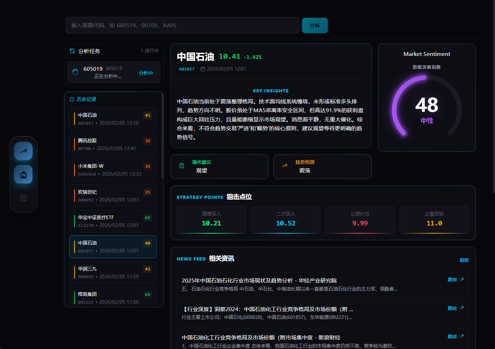

<div align="center">

# 📈 股票智能分析系统

[](https://github.com/ZhuLinsen/daily_stock_analysis/stargazers)
[](https://github.com/ZhuLinsen/daily_stock_analysis/actions/workflows/ci.yml)
[](https://opensource.org/licenses/MIT)
[](https://www.python.org/downloads/)
[](https://github.com/features/actions)
[](https://hub.docker.com/r/zhulinsen/daily_stock_analysis)

<p align="center">
  &nbsp;<a href="https://hellogithub.com/repository/ZhuLinsen/daily_stock_analysis" target="_blank"></a>
</p>

> 🤖 基于 AI 大模型的 A股/港股/美股/日股/韩股/台股自选股智能分析系统，每日自动分析并推送「决策仪表盘」到企业微信/飞书/Telegram/Discord/Slack/邮箱

**[产品预览](#-产品预览)** · **[功能特性](#-功能特性)** · **[快速开始](#-快速开始)** · **[推送效果](#-推送效果)** · **[文档中心](docs/INDEX.md)** · **[完整指南](docs/full-guide.md)**

简体中文 | [English](docs/README_EN.md) | [繁體中文](docs/README_CHT.md)

</div>

## 💖 赞助商 (Sponsors)

<div align="center">
  <p align="center">
    <a href="https://open.anspire.cn/?share_code=QFBC0FYC" target="_blank"></a>
    <a href="https://serpapi.com/baidu-search-api?utm_source=github_daily_stock_analysis" target="_blank"></a>
  </p>
</div>

## 🖥️ 产品预览

<p align="center">
  
</p>

## ✨ 功能特性

| 能力          | 覆盖内容                                                                                                     |
| ----------- | -------------------------------------------------------------------------------------------------------- |
| AI 决策报告     | 核心结论、评分、趋势、买卖点位、风险警报、催化因素、操作检查清单                                                                         |
| 多市场数据聚合     | 覆盖 A股、港股、美股、日股、韩股、台股和 ETF，支持行情、K 线、技术指标、新闻、公告、基本面与报告辅助数据；不同市场的数据源和能力边界见 [市场支持边界](docs/market-support.md) |
| Web / 桌面工作台 | 手动分析、任务进度、历史报告、完整 Markdown、回测、持仓、配置管理、浅色 / 深色主题                                                          |
| Agent 策略问股  | 多轮追问，支持均线、缠论、波浪、趋势、热点、事件、成长、预期等 15 种内置策略，覆盖 Web/Bot/API                                                  |
| 智能导入与补全     | 图片、CSV/Excel、剪贴板导入；股票代码/名称/拼音/别名补全                                                                       |
| 自动化与推送      | GitHub Actions、Docker、本地定时任务、FastAPI 服务和企业微信/飞书/Telegram/Discord/Slack/邮件推送                              |
| **纸面交易**    | **AI 基金经理 — 1000 元虚拟本金，程序化策略主信号 + Agent 风控二次确认，盘中实时触发，T+1/费用/滑点/止损止盈三线一体化**                              |
| **四层系统架构** | **L1 数据基础设施 → L2 业务分析引擎 → L3 操作级自修复 → L4 元认知反思，全链路自主运行**                                                              |
| **系统可观测性** | **L1/L2/L3/L4 全主动观察：事件流（WS 实时）、L4 内省报告、修复效果、健康趋势，统一可观测性面板** |
| **L4 干预模式** | **内省建议 → 门控软参数调整（分析深度/上下文压缩），白名单安全边界 + 事件审计，默认人工确认** |

### 技术栈与数据来源

| 类型    | 支持                                                                                                                                                                                                                                                                                                    |
| ----- | ----------------------------------------------------------------------------------------------------------------------------------------------------------------------------------------------------------------------------------------------------------------------------------------------------- |
| AI 模型 | [Anspire](https://open.anspire.cn/?share_code=QFBC0FYC)、[AIHubMix](https://aihubmix.com/?aff=CfMq)、Gemini、OpenAI 兼容、DeepSeek、通义千问、Claude、Ollama 本地模型等                                                                                                                                                 |
| 行情数据  | [TickFlow](https://tickflow.org/auth/register?ref=WDSGSPS5XC)、AkShare、Tushare、Pytdx、Baostock、YFinance、Longbridge                                                                                                                                                                                      |
| 新闻搜索  | [Anspire](https://open.anspire.cn/?share_code=QFBC0FYC)、[SerpAPI](https://serpapi.com/baidu-search-api?utm_source=github_daily_stock_analysis)、[Tavily](https://tavily.com/)、[Bocha](https://open.bocha.cn/)、[Brave](https://brave.com/search/api/)、[MiniMax](https://platform.minimaxi.com/)、SearXNG |
| 社交舆情  | [Stock Sentiment API](https://api.adanos.org/docs)（Reddit / X / Polymarket，仅美股，可选）                                                                                                                                                                                                                    |

> 完整规则见 [数据源配置](docs/full-guide.md#数据源配置)。

## 🚀 快速开始

### 方式一：[GitHub Actions（推荐）](https://www.bilibili.com/video/BV11FEb66EXG/)

> 5 分钟完成部署，零成本，无需服务器。

#### 1. Fork 本仓库

点击右上角 `Fork` 按钮（顺便点个 Star⭐ 支持一下）

#### 2. 配置 Secrets

`Settings` → `Secrets and variables` → `Actions` → `New repository secret`

**AI 模型配置（至少配置一个）**

默认先选一个模型服务商并填写 API Key；需要多模型、图片识别、本地模型或高级路由时，再参考 [LLM 配置指南](docs/LLM_CONFIG_GUIDE.md)。

| Secret 名称                          | 说明                                                                                                |   必填   |
| ---------------------------------- | ------------------------------------------------------------------------------------------------- | :----: |
| `ANSPIRE_API_KEYS`                 | [Anspire](https://open.anspire.cn/?share_code=QFBC0FYC) API Key，一Key同时启用全球热门大模型和联网搜索，无需科学上网，含免费额度 | **推荐** |
| `AIHUBMIX_KEY`                     | [AIHubMix](https://aihubmix.com/?aff=CfMq) API Key，一Key切换使用全系模型，无需科学上网，本项目可享 10% 优惠               | **推荐** |
| `GEMINI_API_KEY`                   | Google Gemini API Key                                                                             |   可选   |
| `ANTHROPIC_API_KEY`                | Anthropic Claude API Key                                                                          |   可选   |
| `OPENAI_API_KEY`                   | OpenAI 兼容 API Key（支持 DeepSeek、通义千问等）                                                              |   可选   |
| `OPENAI_BASE_URL` / `OPENAI_MODEL` | 使用 OpenAI 兼容服务时填写                                                                                 |   可选   |

> Ollama 更适合本地 / Docker 部署，GitHub Actions 推荐使用云端 API。

**通知渠道配置（至少配置一个）**

| Secret 名称                                 | 说明              |
| ----------------------------------------- | --------------- |
| `WECHAT_WEBHOOK_URL`                      | 企业微信机器人         |
| `FEISHU_WEBHOOK_URL`                      | 飞书机器人           |
| `TELEGRAM_BOT_TOKEN` + `TELEGRAM_CHAT_ID` | Telegram        |
| `DISCORD_WEBHOOK_URL`                     | Discord Webhook |
| `SLACK_BOT_TOKEN` + `SLACK_CHANNEL_ID`    | Slack Bot       |
| `EMAIL_SENDER` + `EMAIL_PASSWORD`         | 邮件推送            |

更多渠道、签名校验、分组邮件、Markdown 转图片等配置见 [通知渠道详细配置](docs/full-guide.md#通知渠道详细配置)。

**自选股配置（必填）**

| Secret 名称    | 说明                                                     |  必填 |
| ------------ | ------------------------------------------------------ | :-: |
| `STOCK_LIST` | 自选股代码，如 `600519,hk00700,AAPL,7203.T,005930.KS,2330.TW` |  ✅  |

**新闻源配置（推荐）**

新闻源会显著影响舆情、公告、事件和催化因素质量，建议至少配置一个搜索服务。

| Secret 名称           | 说明                                                                                                       |   必填   |
| ------------------- | -------------------------------------------------------------------------------------------------------- | :----: |
| `ANSPIRE_API_KEYS`  | [Anspire AI Search](https://aisearch.anspire.cn/)：中文内容特别优化，适合 A 股新闻和舆情检索；同一 Key 可复用为 Anspire 大模型         | **推荐** |
| `SERPAPI_API_KEYS`  | [SerpAPI](https://serpapi.com/baidu-search-api?utm_source=github_daily_stock_analysis)：搜索引擎结果补强，适合实时金融新闻 | **推荐** |
| `TAVILY_API_KEYS`   | [Tavily](https://tavily.com/)：通用新闻搜索 API                                                                 |   可选   |
| `BOCHA_API_KEYS`    | [博查搜索](https://open.bocha.cn/)：中文搜索优化，支持 AI 摘要                                                           |   可选   |
| `BRAVE_API_KEYS`    | [Brave Search](https://brave.com/search/api/)：隐私优先，美股资讯补强                                                |   可选   |
| `MINIMAX_API_KEYS`  | [MiniMax](https://platform.minimaxi.com/)：结构化搜索结果                                                        |   可选   |
| `SEARXNG_BASE_URLS` | SearXNG 自建实例：无配额兜底，适合私有部署                                                                                |   可选   |

更多搜索源、社交舆情和降级规则见 [搜索服务配置](docs/full-guide.md#搜索服务配置)。

#### 3. 启用 Actions

`Actions` 标签 → `I understand my workflows, go ahead and enable them`

#### 4. 手动测试

`Actions` → `每日股票分析` → `Run workflow` → `Run workflow`

#### 完成

默认每个\*\*工作日 18:00（北京时间）\*\*自动执行，也可手动触发。默认非交易日（含 A/H/US 节假日）不执行；强制运行、交易日检查、断点续传等规则见 [完整指南](docs/full-guide.md#定时任务配置)。

### 方式二：[客户端配置教程](https://www.bilibili.com/video/BV11FEb66Eyr/) / 本地运行 / Docker 部署

```bash
# 克隆项目
git clone https://github.com/ZhuLinsen/daily_stock_analysis.git && cd daily_stock_analysis

# 安装依赖
pip install -r requirements.txt

# 配置环境变量
cp .env.example .env && vim .env

# 运行分析
python main.py
```

常用命令：

```bash
python main.py --debug
python main.py --dry-run
python main.py --stocks 600519,hk00700,AAPL,2330.TW
python main.py --market-review
python main.py --schedule
python main.py --serve-only
```

> Docker 部署、定时任务、云服务器访问请参考 [完整指南](docs/full-guide.md)；桌面客户端打包请参考 [桌面端打包说明](docs/desktop-package.md)。

## 📱 推送效果

### 决策仪表盘

```
🎯 2026-02-08 决策仪表盘
共分析3只股票 | 🟢买入:0 🟡观望:2 🔴卖出:1

📊 分析结果摘要
⚪ 中钨高新(000657): 观望 | 评分 65 | 看多
⚪ 永鼎股份(600105): 观望 | 评分 48 | 震荡
🟡 新莱应材(300260): 卖出 | 评分 35 | 看空

⚪ 中钨高新 (000657)
📰 重要信息速览
💭 舆情情绪: 市场关注其AI属性与业绩高增长，情绪偏积极，但需消化短期获利盘和主力流出压力。
📊 业绩预期: 基于舆情信息，公司2025年前三季度业绩同比大幅增长，基本面强劲，为股价提供支撑。

🚨 风险警报:

风险点1：2月5日主力资金大幅净卖出3.63亿元，需警惕短期抛压。
风险点2：筹码集中度高达35.15%，表明筹码分散，拉升阻力可能较大。
风险点3：舆情中提及公司历史违规记录及重组相关风险提示，需保持关注。
✨ 利好催化:

利好1：公司被市场定位为AI服务器HDI核心供应商，受益于AI产业发展。
利好2：2025年前三季度扣非净利润同比暴涨407.52%，业绩表现强劲。
📢 最新动态: 【最新消息】舆情显示公司是AI PCB微钻领域龙头，深度绑定全球头部PCB/载板厂。2月5日主力资金净卖出3.63亿元，需关注后续资金流向。

---
生成时间: 18:00
```

### 大盘复盘

```
🎯 2026-01-10 大盘复盘

📊 主要指数
- 上证指数: 3250.12 (🟢+0.85%)
- 深证成指: 10521.36 (🟢+1.02%)
- 创业板指: 2156.78 (🟢+1.35%)

📈 市场概况
上涨: 3920 | 下跌: 1349 | 涨停: 155 | 跌停: 3

🔥 板块表现
领涨: 互联网服务、文化传媒、小金属
领跌: 保险、航空机场、光伏设备
```

## ⚙️ 配置说明

完整环境变量、模型渠道、通知渠道、数据源优先级、交易纪律、基本面 P0 语义和部署说明请参考 [完整配置指南](docs/full-guide.md)。

## 🖥️ Web 界面

Web 工作台提供配置管理、任务监控、手动分析、历史报告、完整 Markdown 报告、Agent 问股、回测、持仓管理、智能导入和浅色 / 深色主题。



包含完整的配置管理、任务监控和手动分析功能。

**可选密码保护**：在 `.env` 中设置 `ADMIN_AUTH_ENABLED=true` 可启用 Web 登录，首次访问在网页设置初始密码，保护 Settings 中的 API 密钥等敏感配置。详见 [完整指南](docs/full-guide.md)。

### 从图片添加股票

在 **设置 → 基础设置** 中找到「从图片添加」区块，拖拽或选择自选股截图（如 APP 持仓页、行情列表截图），系统会通过 Vision AI 自动识别股票代码并合并到自选列表。

**配置与限制**：

- 需配置 `GEMINI_API_KEY`、`ANTHROPIC_API_KEY` 或 `OPENAI_API_KEY` 中至少一个（Vision 能力模型）
- 支持 JPG、PNG、WebP、GIF，单张最大 5MB；请求超时 60 秒

**API 调用**：`POST /api/v1/stocks/extract-from-image`，表单字段 `file`，返回 `{ "codes": ["600519", "300750", ...] }`。详见 [完整指南](docs/full-guide.md)。

### 📊 纸面交易（AI 基金经理 — 毫秒级实时量化执行系统）

内置一套完整的**毫秒级实时量化交易执行系统**，以 1000 元虚拟本金起步，通过程序化策略规则产生交易信号，可选启用 AI 基金经理 Agent 做二次确认与自主下单，所有交易自动复盘并影响后续决策。同时支持接入东方财富真实券商接口，为实盘交易预留通路。

**核心模块**：

| 模块            | 说明                                                                                   |
| ------------- | ------------------------------------------------------------------------------------ |
| 虚拟账户          | 初始本金可配置（默认 1000 CNY），支持现金/冻结资金/持仓市值/净值曲线                                             |
| 订单状态机         | 限价/市价/条件单，pending → partially\_filled → filled / canceled / rejected，支持撤单与改单，乐观锁并发控制 |
| 费用模型          | 佣金（0.025% min 5 元）+ 印花税（卖方 0.05%）+ 过户费（0.001%）+ 滑点（5 bps）                            |
| 策略规则引擎        | YAML 定义指标（MA/EMA/RSI/MACD/BOLL/ATR/CCI/OBV/威廉/随机等）+ 规则匹配，15 种内置策略模板                  |
| 信号融合引擎        | 多策略加权投票（按 Sharpe SoftMax）、信号冲突仲裁（60% 共识阈值）、漂移检测自动降权                                  |
| 风控前置          | 账户状态、资金充足性、持仓可用性（T+1）、单股集中度 ≤30%、最大 8 持仓、单笔买入 ≤50% 现金                                |
| **三级熔断机制**    | Soft（日亏 3% 禁止开仓）→ Hard（5% 禁止交易）→ Liquidation（8% 强制平仓），24h 冷却期                        |
| **实时风控守护**    | 独立线程监控 VaR（历史模拟法+参数法）、流动性风险（换手率/清仓天数）、市场异常（波动率尖峰）                                    |
| 智能止损止盈        | ATR + Fibonacci + 筹码峰三位一体自动计算止损/一止/二止三线                                              |
| AI 基金经理 Agent | 自主调用工具分析并生成完整交易计划（入场/止损/止盈/仓位），支持自主下单/撤单/改单                                          |
| Agent 风控增强层   | 复用现有 agent factory 对程序化信号做二次确认，再交给 TradingEngine 执行                                  |
| 实时行情监听        | 守护线程生命周期，盘中按 tick 触发策略评估，per-(code,strategy,side) 冷却去重；支持 WebSocket 实时推送             |
| **极端行情应对**    | VIX-like 波动率检波，触发后暂停规则策略 buy 信号 + 禁用市价单开仓，30 分钟自动重检                                  |
| 复盘反思系统        | 每笔交易完成后自动触发复盘，生成基金经理笔记并持久化，进入后续决策上下文                                                 |
| 策略漂移检测        | 滚动 Sharpe 趋势监控，连续亏损天数统计，自动降权/暂停/退役退化策略                                               |
| 策略生命周期        | DRAFT → BACKTEST → PAPER → REVIEW → LIVE → PAUSED → RETIRED 七阶段状态机 + 审批记录            |
| 次日作战卡         | 收盘后生成强势/中性/弱势三情景预案 + 候选标的 + 集合竞价/盘中触发条件                                              |
| **完整回测引擎**    | 逐 bar 历史回测（前后向防作弊）+ 滑点/手续费/涨跌停模拟 + Walk-forward 滚动优化 + 参数敏感性分析                       |
| **日终结算**      | Mark-to-market 持仓市值重估 + 净值曲线计算 + 日终特征工程管线（SMA/RSI/量能/多头排列/买卖不平衡）                     |
| **券商适配层**     | 多源虚拟化抽象（PaperBroker / EastMoneyBroker），支持账户级别路由，券商断连自动 fallback                      |
| **统一时钟源**     | NTP 同步，按交易所时区自动校准，所有模块统一时间基准                                                         |
| **全链路延迟监控**   | 行情→策略→风控→下单路径每步耗时打点，p50/p95/p99 百分位统计                                                |
| **系统健康检查**    | 独立守护线程监控 MarketListener 存活、数据源健康、任务队列积压、系统资源、NTP 同步、券商连接                             |
| **L2 深度行情**   | 十档买卖盘快照 + 订单流信号（大单/冰山/幌骗检测），通过 WebSocket 实时推送                                        |
| 通知集成          | 飞书/钉钉推送作战卡、复盘笔记、日报摘要                                                                 |
| 内容生成          | 自动生成纸面交易日报（Markdown + 语音脚本）                                                          |

### 毫秒级实时仪表板（Web 前端）

所有实时量化能力通过 **15 个专用组件** 在前端可视化：

| 组件                                        | 功能                                          |
| ----------------------------------------- | ------------------------------------------- |
| QuoteTicker + MarketStatusDashboard       | 实时行情滚动条 + CN/HK/US 多市场连接状态                  |
| BreakerStatusBadge + RiskAlertToast       | 熔断状态实时指示 + 风控告警即时 Toast 推送                  |
| LatencyPanel                              | tick 全链路延迟 p50/p95/p99 + 步骤级耗时拆分            |
| EventLogFeed                              | Signal→Risk→Breaker→OMS→Trade 实时事件时间线       |
| StrategyLeaderboard + DriftPanel          | 策略 Sharpe 排行榜 + 漂移检测/降权状态                   |
| StrategyLifecyclePanel                    | DRAFT→LIVE→RETIRED 七阶段策略状态管理                |
| ExtremeMarketBanner                       | 极端行情全宽红色警报横幅                                |
| FeaturesPanel                             | 特征工程计算查看 + 手动触发重算                           |
| CandlestickChart                          | K 线图（Close 线 + MA5 + MA20 + 成交量）            |
| PerformanceCard + BacktestComparisonPanel | 绩效指标（Sharpe/MaxDD/Calmar/胜率） + 回测 vs 纸面模拟对比 |

**快速启用**：

1. 在 `.env` 中设置 `PAPER_TRADING_ENABLED=true`
2. 调整虚拟本金：`PAPER_TRADING_INITIAL_CAPITAL=1000.0`
3. 设置观察标的：`PAPER_TRADING_WATCHED_CODES=600519,300750,000001`
4. 启用 AI 基金经理（可选，需 LLM）：`PAPER_TRADING_ENABLE_PM_AGENT=true`
5. 启用 Agent 风控二次确认（可选）：`PAPER_TRADING_ENABLE_AGENT_REVIEW=true`
6. 启用盘中实时监听（可选）：`PAPER_TRADING_LISTENER_ENABLE_STRATEGIES=true`
7. 启用健康检查：`HEALTH_CHECK_ENABLED=true`

> 完整配置项详见 `.env.example` 中 `Paper Trading` 段落。所有模块均支持独立开关，未启用时不影响原有分析功能。架构设计文档见 [实时量化系统设计](docs/architecture/realtime_quant_system_design.md)。

**API 端点**：`/api/v1/paper-trading/*`，包含账户快照、持仓查询、订单管理、信号提交、作战卡生成、复盘笔记、性能指标、回测对比、延迟统计、漂移报告、极端行情状态、特征工程、策略管理等 50+ 端点。

### 📊 系统可观测性（L1/L2/L3/L4 全主动观察）

系统四层架构（数据基础设施 → 业务分析 → 操作级自修复 → 元认知反思）通过 **SystemEventBus** 全主动观察互通，前端「可观测性」面板（`/observability`）可视化系统自我认知：

| 能力 | 说明 |
|---|---|
| 实时事件流 | WebSocket 推送 L1/L2/L3/L4 全部事件（数据源降级/管线/Agent 工具/配置回归/模块重启/反思），REST 分页历史 + WS 断开轮询降级 |
| L4 内省报告 | MetaCognitiveEngine 自我认知摘要 + 偏差/循环检测，可手动触发深度反思 |
| 修复效果 | RepairEffectivenessLog 修复记录 + 成功率分析 |
| 健康趋势 | HealthCheckDaemon 历史检查趋势 |
| **L4 干预模式** | 内省建议 → 安全软参数调整（分析深度/上下文压缩），白名单门控 + 默认人工确认 + 全程事件审计，绝不触碰交易路径 |

> 完整使用说明见 [系统可观测性与 L4 干预模式](docs/observability.md)。API 参考见 `/api/v1/observability/*`。

## 🗺️ Roadmap

### 纸面交易系统（已完成对齐）

纸面交易系统已升级为**毫秒级实时量化执行系统**（v2），23 项后端 gap 全部闭合 + 15 个前端实时组件上线：

- **P0 上线硬前置**：完整回测框架（滑点/手续费/涨跌停/Walk-forward）、券商适配层（PaperBroker + EastMoneyBroker）、NTP 时钟同步
- **P1 上线必备**：WebSocket 行情双通道接入、三级熔断、实时风控守护、系统健康检查
- **P2 规模化前提**：数据质量 Pipeline、行情持久化仓库、OMS/RMS 分离、全链路延迟监控、订单幂等化
- **P3 竞争力差异**：L2 深度行情、信号融合与冲突仲裁、企业事件处理、特征工程管线、在线学习与模型漂移检测

> 详细架构设计见 [实时量化系统设计](docs/architecture/realtime_quant_system_design.md) • 差距分析报告见 [v2 后报告](docs/realtime_quant_system_gap_analysis_v2.md) • 前端对齐报告见 [v2 报告](docs/frontend_quant_alignment_gap_analysis_v2.md)

### 未来计划

查看已支持的功能和未来规划：[更新日志](docs/CHANGELOG.md)

> 有建议？欢迎 [提交 Issue](https://github.com/ZhuLinsen/daily_stock_analysis/issues)

***

## ☕ 支持项目

如果本项目对你有帮助，欢迎支持项目的持续维护与迭代，感谢支持 🙏\
赞赏可备注联系方式，祝股市长虹

| 支持原作者 (Alipay) | 支持原作者 (WeChat) | 支持本项目 (Alipay) | 支持本项目 (WeChat) |
| :---: | :---: | :---: | :---: |
|  |  |  |  |

***

## 🤝 贡献

欢迎提交 Issue 和 Pull Request！

详见 [贡献指南](docs/CONTRIBUTING.md)

### 本地门禁（建议先跑）

```bash
python main.py --webui
python main.py --webui-only
```

访问 `http://127.0.0.1:8000` 即可使用。认证、智能导入、搜索补全、历史报告复制、云服务器访问等细节见 [本地 WebUI 管理界面](docs/full-guide.md#本地-webui-管理界面)。

## 🤖 Agent 策略问股

配置任意可用 AI API Key 后，Web `/chat` 页面即可使用策略问股；如需显式关闭可设置 `AGENT_MODE=false`。

- 支持均线金叉、缠论、波浪理论、多头趋势、热点题材、事件驱动、成长质量、预期重估等内置策略
- 支持实时行情、K 线、技术指标、新闻和风险信息调用
- 支持多轮追问、会话导出、发送到通知渠道和后台执行
- 支持自定义策略文件与多 Agent 编排（实验性）

> Agent 具体参数、`skill` 命名兼容、多 Agent 模式和预算护栏见 [完整指南](docs/full-guide.md#本地-webui-管理界面) 与 [LLM 配置指南](docs/LLM_CONFIG_GUIDE.md)。

## 🧩 相关项目 (Related Projects)

> DSA 聚焦日常分析报告；下面两个同系列项目分别覆盖选股、策略验证与策略进化，适合按需延伸使用。它们当前独立维护，后续会优先探索与 DSA 的候选股导入、回测验证和报告联动。

| 项目                                                  | 定位                                |
| --------------------------------------------------- | --------------------------------- |
| [AlphaSift](https://github.com/ZhuLinsen/alphasift) | 多因子选股与全市场扫描，用于从股票池中提取候选标的         |
| [AlphaEvo](https://github.com/ZhuLinsen/alphaevo)   | 策略回测与自我进化，用于验证策略规则，并通过迭代探索策略参数与组合 |

## 📬 联系与合作

<table>
  <tr>
    <td width="92" valign="top"><strong>合作邮箱</strong></td>
    <td valign="top">
      <a href="mailto:zhuls345@gmail.com">zhuls345@gmail.com</a><br>
      项目咨询、部署支持与功能扩展
    </td>
    <td align="center" rowspan="3" valign="middle" width="148">
      <a href="http://xhslink.com/m/tU520DWCKT" target="_blank"></a><br>
      <sub>扫码关注小红书</sub>
    </td>
  </tr>
  <tr>
    <td width="92" valign="top"><strong>小红书</strong></td>
    <td valign="top"><a href="http://xhslink.com/m/tU520DWCKT">欢迎关注小红书</a></td>
  </tr>
  <tr>
    <td width="92" valign="top"><strong>问题反馈</strong></td>
    <td valign="top"><a href="https://github.com/ZhuLinsen/daily_stock_analysis/issues">提交 Issue</a></td>
  </tr>
</table>

## 📄 License

[MIT License](LICENSE) © 2026 ZhuLinsen

欢迎在二次开发或引用时注明本仓库来源，感谢支持项目持续维护。

## ⚠️ 免责声明

本项目仅供学习和研究使用，不构成任何投资建议。股市有风险，投资需谨慎。作者不对使用本项目产生的任何损失负责。

***

